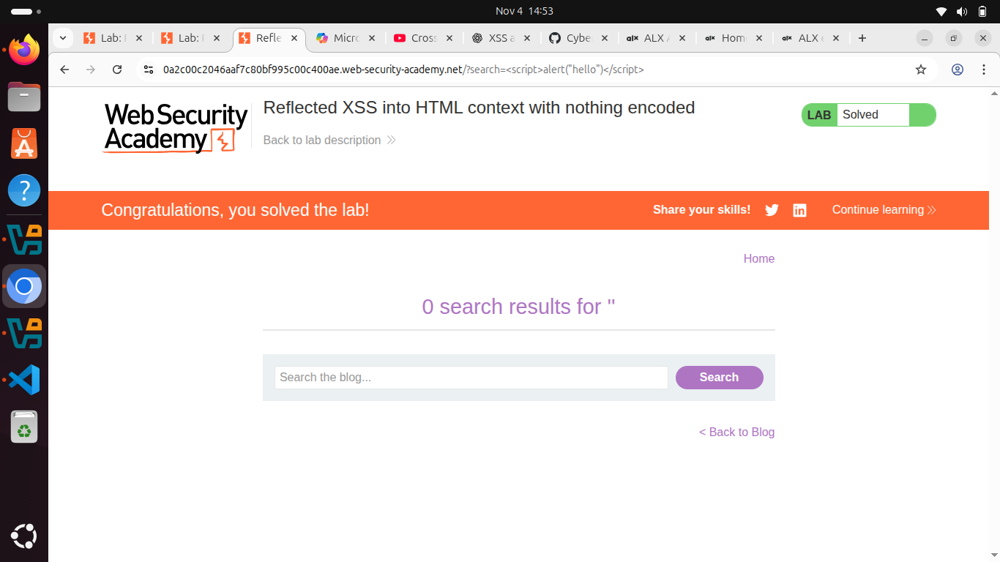
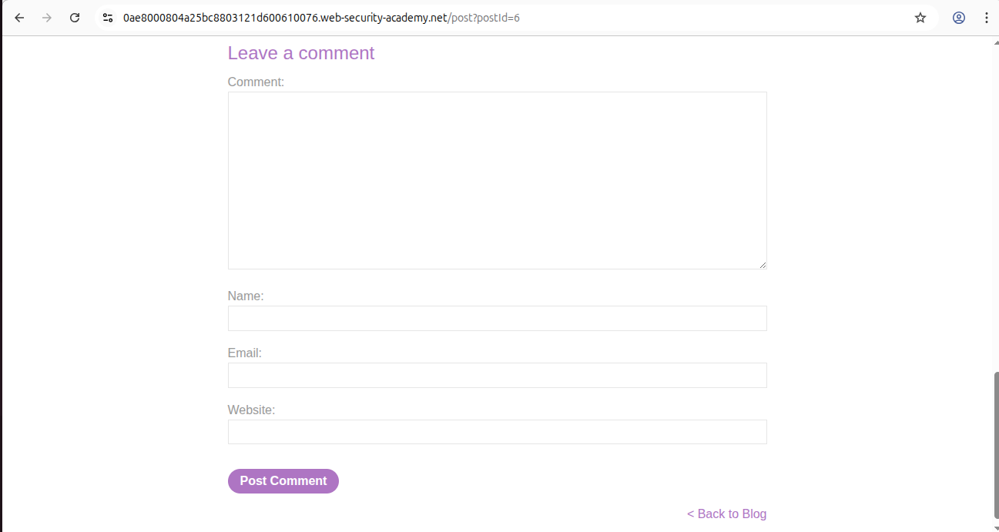

# Cross site scripting
Cross-Site Scripting/ XSS is a type of web security vulnerability that allows attackers to inject malicious scripts (usually JavaScript) into webpages viewed by other users. If a website doesn’t properly validate or sanitize user input, an attacker can exploit it to execute their script in the browser of anyone visiting the page.

## How XSS works
1. An attacker finds a place in a website that accepts user input (like a comment section, search box, or URL parameter).

2. They inject a malicious script into that input.

3. When another user loads that page, the browser executes the attacker’s script as if it were part of the website.

4. The script can steal cookies, session tokens, or other sensitive information, or even perform actions on behalf of the user.

## How to test if a website is vulnerable to XSS
**proof of concept(PoC)** - To prove an XSS vulnerability exists, you inject a small bit of JavaScript that runs in the victim’s browser.

1. Usually, you test XSS by putting a tiny bit of code like alert("XSS") on a page. If a popup shows up, the site is vulnerable.

2. But in new versions of Chrome, alert() doesn’t work in some special cases (like when a page is inside another site).

3. So now, you can use print() instead to test it.

## Types of XSS attacks
1. **Reflected XSS** - where the malicious script comes from the current HTTP request.

**Example**
This lab contains a simple reflected cross-site scripting vulnerability in the search functionality.

To solve the lab, perform a cross-site scripting attack that calls the alert function.

## Steps I used in solving the lab
1. When you try searching for something in that search input, you will see some raw text in the address bar. Something like this **search=whatever you searched**
2. To solve the lab you can just inject a javascript code in that url ie ****
3. It will return the alert message meaning that it's vulnerbale to xss

2. **Stored XSS** - malicious script comes from the website's database.

### I have a lab here demonstrating stored xss
This lab contains a stored cross-site scripting vulnerability in the comment functionality.
To solve this lab, submit a comment that calls the alert function when the blog post is viewed.

So you can see in this lab I am expected to submit a comment that will call the alaert function. Since it will be stored in a database, anyone visiting that post will see that alert message

## How I solved the lab
I injected this script in the comment section **

**